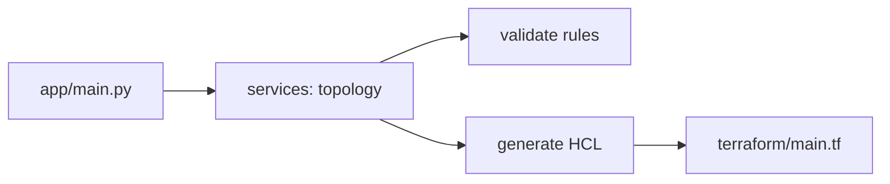

# infra-3tier-aws

[](https://github.com/Shamanchi/infra-3tier-aws/actions/workflows/ci.yml)
[](https://www.python.org/)
[](./Dockerfile)
[](./LICENSE)

> **English TL;DR:** CLI tool that validates a 3-tier AWS topology JSON (VPC CIDR, public/private/db subnets, DB exposure) and generates matching Terraform HCL. Fully offline, stdlib only.

CLI-инструмент для 3-tier архитектуры AWS: проверяет топологию в JSON (CIDR VPC, публичные/приватные/DB-подсети, доступ к БД) и генерирует Terraform HCL. Только стандартная библиотека, офлайн.

Источник темы: `DevOps-Projects / P-01 (project-01-java-aws-3tier)` — идею и постановку взяли из каталога, код и тексты написаны с нуля.

## Какую задачу решает

Ошибки в сетевой топологии дорого стоят: пересекающиеся CIDR, БД открытая в интернет, одна зона доступности. Инструмент ловит их до `terraform apply` и генерирует стартовый `main.tf`.

## Архитектура



Слои: CLI → `services/` → `core/`, настройки через `pydantic-settings`.

## Быстрый старт

```bash
cp .env.example .env
pip install -r requirements.txt
python -m app.main validate --file examples/topology.json
python -m app.main generate --cidr 10.0.0.0/16 --azs 2 --out terraform/generated.tf
```

Пример топологии — в [examples/topology.json](./examples/topology.json), эталонный манифест — в [terraform/main.tf](./terraform/main.tf).

## CLI

- `validate --file PATH` — проверить топологию JSON. Exit 0 — ок, 2 — ошибки (список в stdout).
- `generate --cidr CIDR --azs N --out PATH` — сгенерировать VPC + подсети + SG в HCL.

## Переменные окружения (.env)

| Переменная | Назначение | По умолчанию |
|---|---|---|
| `AWS_REGION` | Регион для генерируемого HCL | `eu-central-1` |
| `OUTPUT_DIR` | Папка вывода generate без `--out` | `./out` |
| `APP_ENV` | Окружение | `development` |

Полный список — в [.env.example](./.env.example).

## Тесты

```bash
pip install -r requirements.txt
pytest -q
pytest -q -m integration
```

Unit-тесты без сети. Интеграционные (`-m integration`) — CLI через subprocess, тоже без сети.

## Контакты

- Telegram: @PavelYrevichh
- Email: Lietman46@mail.ru
- GitHub: Shamanchi
- FL.ru: https://www.fl.ru/users/Shamanchi
